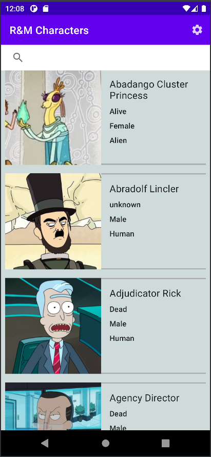
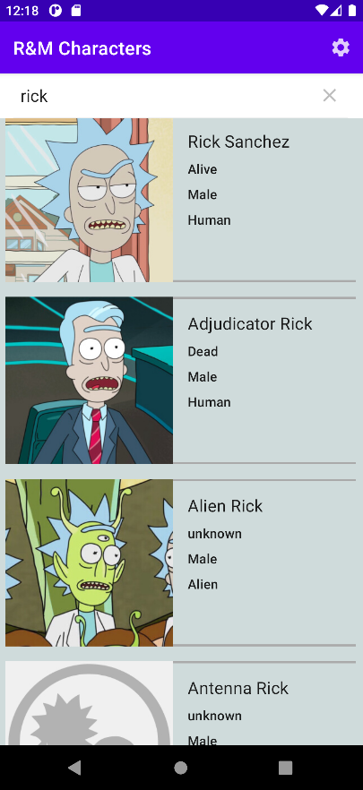
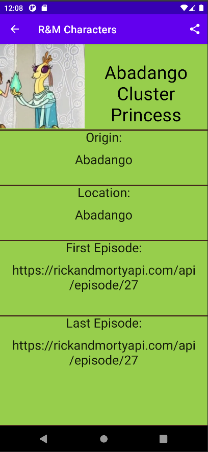
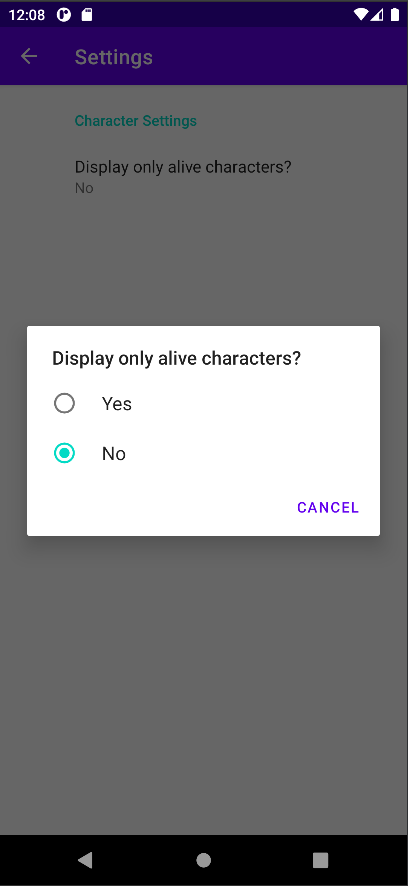

# Rick And Morty Characters App

## ABOUT
An Android application that displays information about Rick and Morty Characters using the Rick and Morty Rest API (https://rickandmortyapi.com/).
Scrollable, search functionality, expanded detail pane, settings pane, and share capabilities. 

## How to run the application
1) Download Android Studio: https://developer.android.com/studio'
2) Create an Android Virtual device in Android Studio: https://developer.android.com/studio/run/emulator
3) Clone or download and extract project files from downloaded .zip file
4) Place project files into appropriate Android Studio projects folder
5) Run project on Android Emulator

## Screenshots

 

 

